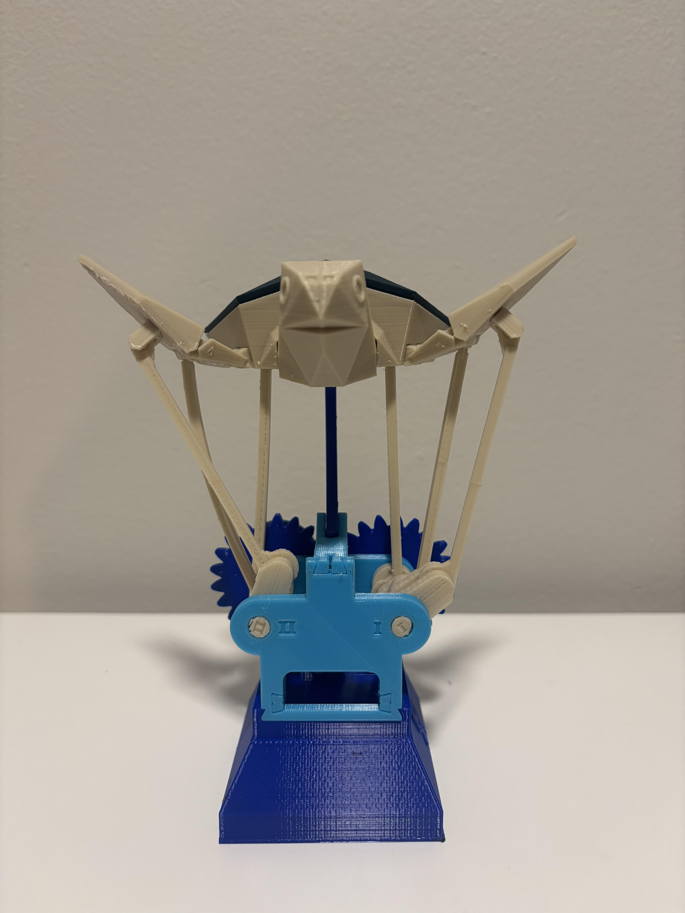

# Flying Turtle - FFF 3D Printing & Kinematic Mechanism

A 14-component mechanical assembly fabricated using Fused Filament Fabrication (FFF) / 3D printing technology for **ME 557: Additive Manufacturing**. This repository contains the slicing parameter documentation, CAD/STL models, and assembly setup to optimize print reliability, joint tolerances, and structural integrity.

---

## 🛠️ Project Overview

The **Flying Turtle** mechanism transforms rotary input into coordinated kinematic movement across multiple linkages, gears, and frames. 

* **Total Components:** 14 unique 3D-printed parts
* **Fabrication Method:** Fused Filament Fabrication (FFF)
* **Key Challenges:** Thermal expansion causing moving joints to fuse near the heated bed; fine-pitch gear tooth resolution; micro-tolerancing on crankshaft linkages.

---

## ⚙️ Hardware & Software Specifications

* **3D Printer:** Creality Ender-3
* **Slicer Software:** UltiMaker Cura
* **Material:** PLA Filament (1.75 mm)
* **Nozzle Diameter:** 0.4 mm
* **Print Speed:** 50 mm/s

---

## 📊 Print Parameters & Slicing Strategy

To resolve bed-heat fusion on micro-joints and ensure smooth gear meshing, components were categorized and printed under specialized parameter profiles:

| Parameter | Easy Components (Frames, Input Handles) | Complex Components (Crankshaft, Turtle Base) | Gear II (Fine Pitch) |
| :--- | :--- | :--- | :--- |
| **Layer Height** | 0.20 mm | 0.20 mm | **0.15 mm** |
| **Nozzle Temp** | 205°C | 202°C | 202°C |
| **Bed Temp** | 62°C | 52°C – 55°C | 52°C |
| **Infill Density** | 40–50% (Lines) | 30–40% (Lines) | 40% (Lines) |
| **Bed Adhesion** | Brim + Hairspray | **Raft** | Raft |
| **Support Type** | Tree / Touching Buildplate | None | None |

---

## 💡 Key Engineering Insights & Solutions

* **Preventing Bed Fusion on Joints:** High bed temperatures ($>60^\circ\text{C}$) caused small lower joints on the crankshaft and base to thermally expand and fuse. Lowering the bed temperature to $52^\circ\text{C} - 55^\circ\text{C}$ and switching to a **Raft adhesion layer** elevated sensitive hinges off the heated bed, preserving clearance.
* **Gear Meshing Precision:** Decreasing the layer height to $0.15\text{ mm}$ for Gear II significantly improved involute profile accuracy and reduced backlash.
* **Assembly Performance:** Post-assembly verification showed full mechanical functionality across all moving linkages.

---

**Repository Structure**

```text
├── STL Files/                   # 3D Printable STL files for all 14 components
│   ├── Part A/
│   ├── Part B/
│   └── Part C/
├── Cura_Profiles/               # Exported .3mf / Cura slicing profiles
├── ME557- Additive Manufacturing Project 1.pdf # PDF file with project info
└── README.md                    # Project documentation
```


